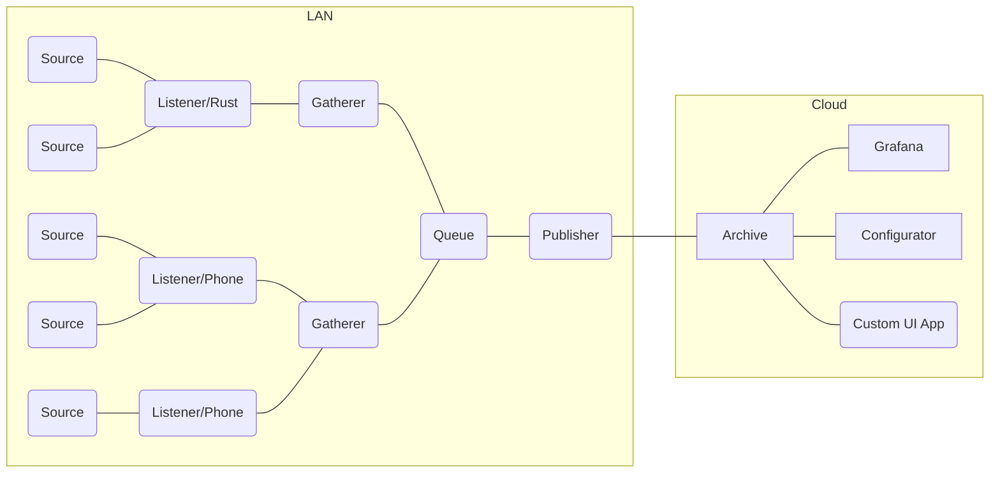
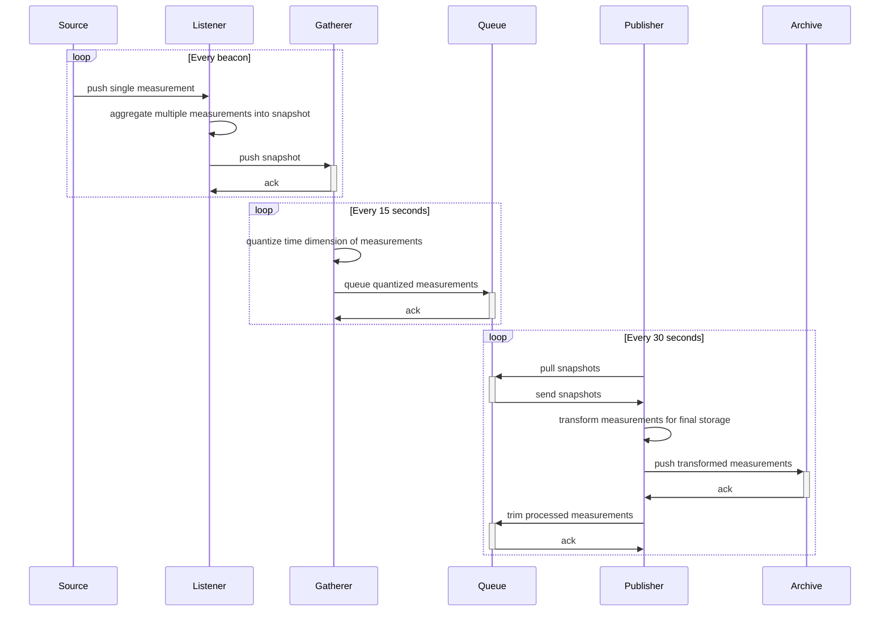

# Ruuvipuserrin

This is a rebuild of [unkhz/ruuvitaulu](https://github.com/unkhz/ruuvitaulu), attempting to improve fault tolerance

- separate measurement delegation functionality (gateway) from parsing the data, so that there can be multiple redundant gateway boxes connected to single parser pipeline
- disconnect configuration data (e.g. friendly names for data sources) from measurement data, so that source configurations can be applied to historical points in time
- avoid storing measurements in the gateway after they have been succesfully passed on, so that gateway boxes do not run out of space
- avoid unnecessary gaps in data caused by inevitable network issues between the gateway boxes and the final storage in cloud

## Implementation

Following shiny tools are used

- [Redis Streams](https://redis.io/docs/data-types/streams/) for durable processing of measurements
- [TimescaleDb](https://www.timescale.com/) for SQL based long term storage of time series data
- [Task](https://taskfile.dev/) for task running
- [Bun workspaces](https://bun.sh/docs/install/workspaces) for monorepo organization
- [Bun](https://bun.sh) TypeScript runtime for faster microservices (where necessary APIs are supported)
- [tRPC](https://trpc.io/) type-safe API for exposing database to serverless functions and apps
- [ruuvitag-listener](https://github.com/lautis/ruuvitag-listener) fast readings from Ruuvitag devices, written in Rust
- [Remix.run](https://remix.run/) for HTML first web application UI
- [TailwindCSS](https://tailwindcss.com/) for lightweight and scalable styles
- [DaisyUI](https://daisyui.com/) for CSS-only components

### Install

Ensure you have installed following tools in your gateway box (e.g. raspberry pi).

- [Rust](https://rustup.rs/)
- [Bun](https://bun.sh/)
- [Redis](https://redis.io/docs/getting-started/installation/install-redis-on-linux/)

Install monorepo dependencies

```
bun install
```

Run package specific setup scripts

```
task common-data:setup
task infra-redis:setup
```

### Running

Run gateway functionality in gateway box

```
task start-gateway
```

## Architecture

#### System components

| Entity    | Description                   | Phase            | Responsibility                                                                                                |
| --------- | ----------------------------- | ---------------- | ------------------------------------------------------------------------------------------------------------- |
| Source    | IoT device                    | Extract          | sends e.g. bluetooth beacons containing measurements of physical system properties like temperature, humidity |
| Listener  | Rust app / Ruuvi Station      | Extract          | captures measurements, forwards to gateway box                                                                |
| Gatherer  | Typescript app w/ Bun runtime | Staging          | receives data from a different network, stores intermediate snapshots of measurement                          |
| Queue     | Redis streams                 | Staging          | holds measurements, allows quantizing the time dimension of measurements                                      |
| Publisher | Typescript app w/ Bun runtime | Transform / Load | transforms intermediate data into final format, pushes final data forward towards Archive                     |
| Archive   | tRPC API for TimescaleDb      | Load             | stores data in final format, provides to consumers like Grafana, Configurator                                 |

#### Network topology diagram (example setup)



#### Communication sequence diagram


